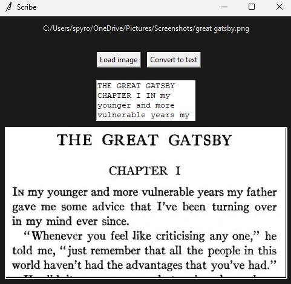

# Scribe

Scribe is a powerful OCR (Optical Character Recognition) application that extracts text from images using EasyOCR. It provides both a command-line interface (CLI) and a graphical user interface (GUI) for different use cases.

## Features

-   **High Accuracy OCR**: Uses EasyOCR with GPU acceleration for fast and accurate text extraction
-   **Image Processing**: Automatically enhances images with resizing, sharpening, and noise reduction
-   **Dual Interface**: Both CLI and GUI options for different workflows
-   **Clipboard Integration**: Automatically copies extracted text to clipboard
-   **Multiple Image Formats**: Supports PNG, JPG, JPEG, BMP, and GIF files
-   **Confidence Scoring**: Shows confidence levels for each detected text segment

### Examples

#### GUI


#### CLIE

### Download

[Download latest version.](https://github.com/AndrewCutler/scribe/releases/tag/v0.0.1-alpha)

## For Devs

### Install Dependencies

```bash
pip install easyocr opencv-python pyperclip termcolor click pillow
```

### Run locally

```bash
# Run GUI
watchmedo auto-restart --patterns='scribe/gui.py;core.py' --recursive -- python gui_entry.py
```

```bash
# Run CLI
python cli_entry.py path/to/image.png
```

### Build Executables (Optional)

The project includes PyInstaller spec files for building standalone executables:

```bash
# Build CLI executable
pyinstaller cli_optimized.spec

# Build GUI executable
pyinstaller gui_entry.spec

# Build both
pyinstaller build.spec
```

### Create installers

#### Windows
First, make sure [Inno](https://jrsoftware.org/isdl.php) is installed.
```powershell
cd installers ; & "C:\Program Files (x86)\Inno Setup 6\ISCC.exe" scribe.iss
```

This will generate installers/dist/scribe_installer.exe.

## Usage

### Command Line Interface (CLI)

The CLI application is perfect for batch processing, automation, and quick text extraction from command line.


### Building Executables

```bash
# Install PyInstaller
pip install pyinstaller

# Build optimized CLI
pyinstaller --onefile cli_optimized.py

# Build GUI
pyinstaller --onefile gui_entry.py
```

## Performance Tips

-   **GPU Usage**: Ensure CUDA is properly installed for GPU acceleration
-   **Image Quality**: Higher resolution images generally produce better results
-   **Image Preprocessing**: The application automatically enhances images, but clean, well-lit images work best
-   **Text Orientation**: Ensure text is horizontal for best results

## Troubleshooting

### Common Issues

1. **CUDA/GPU Issues**: If GPU initialization fails, the application will fall back to CPU processing
2. **Image Loading**: Ensure the image file exists and is in a supported format
3. **Memory Usage**: Large images may require significant memory; consider resizing very large images

## License

This project is open source. Please check the license file for details.
